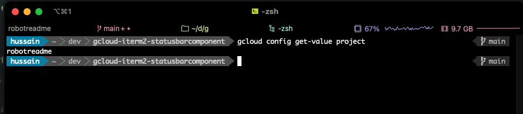

# gcloud status bar component for iTerm2

[iTerm2](https://iterm2.com/index.html) [Status Bar](https://iterm2.com/3.3/documentation-status-bar.html) Component to show the current Google Cloud project.

example: upper right of status bar shows `robotreadme` as the current gcloud project.

This calls `gcloud config get-value project` and assumes 1) that you have a Google Cloud account, 2) you have installed the [Google Cloud SDK](https://cloud.google.com/sdk/docs/install), and 3) have [initialized it](https://cloud.google.com/sdk/docs/initializing) by logging in.

Install this by:

* Placing the script in `$HOME/Library/ApplicationSupport/iTerm2/Scripts/AutoLaunch` directory.

   You may have to create the `AutoLaunch` dir in `$HOME/Library/ApplicationSupport/iTerm2/Scripts`.  You may also have to enable the [Python API within iTerm2](https://iterm2.com/python-api-auth.html).

* Restarting iTerm2.
